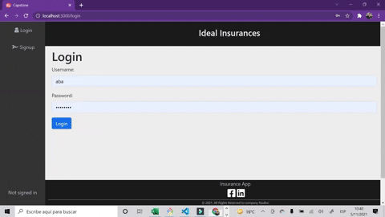

#  CAPSTONE - Ideal Insurances Web APP - FINAL PROJECT 

## DISTINCTIVENESS AND COMPLEXITY
- This is a web application focused on the health insurance industry. Specifically for health insurance agents.This web app allows the creation, update and deletion of contacts, allows you to convert a contact into a customer, updates customer information and also allows its deletion. It has an algorithm for calculating the annual profit depending on the number of clients, the contracted plan or plans, payment made by the plan or plans and the age of the client. The profit is displayed in the section called Dashboard. The profit represents like a bank account for the health insurance agent. Profit will increase if the health insurance agent converts a contact into a customer and will decrease if the insurance agent removes a customer.
- This application is more complex than the projects in the Web CS50 course, because it is a Web App that manages several states simultaneously, allowing several elements of the DOM to be updated at the same time. For this, Redux was implemented. This web application allows you to automatically change the DOM and update the backend database without reloading the page, dynamically. Also, this web application is a SPA (single page application) which makes the user experience pleasant. An algorithm was also implemented to calculate the accumulated profit of the user or insurance agent from the sales made. This profit is based on the client's age, the amount of coverage and the deductible of the contracted plan. In other words, it is an application that uses both mathematics for the implementation of the algorithm and the technologies learned in the CS50 Web course, which are Django, JavaScript and React.

## PROJECT STRUCTURE
Ideal Insurances Web APP is an app built in Django (including FOUR models: User, PlanSeguro, Contact, Customer) on the back-end and JavaScript using React - Redux libraries on the front-end. Next, a tree of the project structure is presented:

```
📦FINAL PROJECT 
    ┣ 📦FRONT-END (JavaScript - React - Redux)
    ┣ 📂front_end
    ┃    ┣ 📂....
    ┃    ┣ 📂public
    ┃    ┃  ┣ 📜index.html
    ┃    ┃  ┣ 📜.....
    ┃    ┣ 📂src
    ┃    ┃  ┣📂assets
    ┃    ┃  ┣📂components
    ┃    ┃  ┣📂helpers
    ┃    ┃  ┣📂pages
    ┃    ┃  ┣📂slices
    ┃    ┃  ┣ 📜App.js
    ┃    ┃  ┣ 📜index.css
    ┗    ┗  ┗ 📜index.js    

```

### Front end 
- React + Redux.-
React Redux was used for the front end. Additionally, Redux toolkit is used to manage the status on the front end of this web App. The use of React and Redux toolkit allows this web app to be an application that behaves consistently and with a dynamic experience for the end user.
It is important to indicate that Action and Reducers are combined in redux toolkit as Slice. Sixteen slices are created to connect to the endpoints using fetch, which were created in django.
CreateSlice is used which handles the action and the reducer in one function. After that the reducer is added in the redux store.
Once a structure for redux and store was created, the components for the application were designed.

CombineReducers that combines all reducers into one root reducer that the store uses (./slices/index.js). An extract of the code is presented:

```javascript
const rootReducer = combineReducers({
    login: loginReducer,
    user: userRedurcer,
    signup: signupReducer,
    new_contact: newcontactReducer,
    contacts: contactsReducer,
    ......
})
```
Redux Store:
```javascript
    const store = configureStore({reducer:rootReducer})
    ReactDOM.render(
    <React.StrictMode>
        <Provider store={store}>
        <App />
        <Toaster />
        </Provider>
    </React.StrictMode>,
    document.getElementById('root')
    );
```

- React Router.-
This Web App is a SPA (single page application), and clicking on any internal page from the website does not need to load a completely new resource. The react-router-dom library is used to achieve routing in this Web App. Routing is the way that web applications direct traffic.

```javascript
    import { BrowserRouter as Router, Switch, Route, Redirect } from 'react-router-dom';
    ....
    function App() {
    return (
        <div className="App">
        <Router>
            <Layout>
            <Switch>
                <Route exact path='/login' component={Login}/>
                <Route exact path='/signup' component={Signup}/>
                <PrivateRoute exact path='/' component={HomePage}/>
                <PrivateRoute exact path='/add_contact' component={AddContact} />
                <PrivateRoute exact path='/contact' component={ContactProfile}/>
                <PrivateRoute exact path='/plans' component={PlansPage}/>
                <PrivateRoute exact path='/dashboard' component={Dashboard}/>
                <Redirect to='/login' />
            </Switch>
            </Layout>
        </Router>
        </div>
    );
    }
```

## EXPLAINING THE PROJECT
This application for health insurance agents has the following functionalities:

### Register and Login
- It allows the registration of new users (entering the username, email and password information). For this web app a user is a health insurance agent.
- Once registered, the user or health insurance agent will enter the web app using their username and password.

| Register | Login |
| :---: | :---: |
|   | |


In the front end to have private routes, the following code was created located in the helpers folder, in the PrivateRoute.js file, and whose component is imported into App.js to be used in the routes that you want to be accessed only if the user has been authenticated.

```javascript
    export const PrivateRoute = ({ component: Component, ...rest }) => (
    <Route
        {...rest}
        render={(props) =>
        (localStorage.getItem('token')) ? (
            <Component {...props} />
        ) : (
            <Redirect
            to={{ pathname: '/login', state: { from: props.location } }}
            />
        )
        }
    />
    );
```

### Dynamically Contact Registration
- This web app allows the user or insurance agent to register contacts dynamically, without having to reload the entire page. In other words, this APP allows you to automatically change the DOM and update the back end database without reloading the page.
- Registered contacts are displayed in a table that dynamically indicates whether the contact is a customer or not a customer.
- The contact table allows pagination and search of contacts on the front end.
- Additionally, it allows you to view the accumulated contacts over time in the graph called Contacts over Time. In javascript it is graphed using the recharts library.

| Contact Registration | Search - Pagination |
| :---: | :---: |
|   | |

To update the information without reloading the page we use the hooks useEffect and useState (ModalNewContact.js):

```javascript
    const OnSubmit = (e) => {
        e.preventDefault();
        const data = {
            name: contact, 
            phone: phone, 
            email: email, 
            creador: pk,
            token: token
        };
        setLoad(true);
        dispatch(new_contact(data));
        setContact('');
        setPhone('');
        setEmail('');
        props.onHide();
    };

    useEffect(() => {
        if (load) {
            dispatch(get_contacts({pk, token}));
            dispatch(graphcontacts({pk}));
            setLoad(false);
        }
    }, [dispatch, load, pk, token]);
```
### Transform from Contact to Customer
- Once a contact is registered, this application allows you to convert the contact into a health insurance customer, in the event that the business of selling health insurance has been finalized. To do this, the user of this app or insurance agent clicks on the name of the contact, loading their profile page. The insurance agent on the profile page can create a client with the information about the contracted plan or plans, the monthly payment and the client's age. Additionally on the profile page the insurance agent can update the contact information, delete the contact, update the customer information or delete a customer. Everything stated is done with React automatically changing the DOM and updating the Back end database without having to reload the page. 

| Create a Customer | Edit a Customer |
| :---: | :---: |
|   | |

In this application to send an action in redux, useDispatch provided by react-redux is used. The redux state is accessed in the component using hooks, useSelector.

```javascript
useEffect(() => {
        if(contact_id) {
            dispatch(getcustomer({contact_id, token}));
        }
    }, [dispatch, contact_id, token]);

    const {successCustomer, errorsCustomer, customer} = useSelector(getcustomerSelector);
```

Additionally, in the profile page of each contact - customer, it was graphed with the following code using the recharts library.

```javascript
    <BarChart
        width={300}
        height={300}
        data={customer.planes}
        margin={{
            top: 5,
            right: 30,
            left: 20,
            bottom: 15
            }}
    >
        <CartesianGrid strokeDasharray="3 3" />
        <XAxis dataKey="plan" />
        <YAxis />
        <Tooltip />
        <Legend wrapperStyle={{top: 280, left: 25}}/>
        <Bar dataKey="coverage" fill="#700B97" />                                    
    </BarChart>
```
| Charts on the profile page |
| :---: |
| |


In the Dashboard page of the Front - end the information of the profit over time and that of the consolidated profit is shown to the user or insurance agent. Additionally, a table of the clients that generate the profit, the plans that are more profitable and the efficiency between registered contacts and the clients generated by the insurance agent is shown on the Dashboard page. It is important to note that the information for the different plans is loaded from the Django database.

| Dashboard | Plans |
| :---: | :---: |
|   | |

Additionally, through a modal, indicators such as the average age of the clients, the average of payments and the average of the coverage contracted are shown. The code for these indicators is as follows:

```javascript
    const {customers, loadingCustomers, successCustomers, errorsCustomers} = useSelector(customersSelector);

    var total = 0;
    for (let i = 0; i < customers.length; i++) {
        total += customers[i].profit;
    };
    total = total.toFixed(2);

    var age = 0;
    for(let i=0; i<customers.length; i++) {
        age += customers[i].age;
    };
    age = (age/customers.length).toFixed(1);

    var payment = 0;
    for(let i=0; i<customers.length; i++) {
        payment += customers[i].payment;
    };
    payment = (payment/customers.length).toFixed(2);
    
    var coverage = 0;
    var longuitud = 0;
    var coverageAverage = 0;
    for(let i=0; i<customers.length; i++) {
        for(let j=0; j<customers[i].planes.length; j++) {
            coverage += customers[i].planes[j].coverage;
        };
        longuitud += customers[i].planes.length;
    };
    coverageAverage = (coverage/longuitud).toFixed(0);
    var today = new Date().toLocaleDateString();
```

## Style and Design
- Bootstrap was used for styling in conjunction with vanilla CSS (index.css). Additionally to create the effect of opaque texture of a sheet of paper, the library called material-ui was used.
- For the design, several components were created for the Footer, Sidebar, Navbar, which were imported into another component called Layout. These React components made it possible to divide the user interface into separate, reusable pieces.
```javascript
    <Fragment>
            <Navegador 
                setshowSidebar={setshowSidebar}
            />
            <Sidebar showSidebar={showSidebar} setshowSidebar={setshowSidebar}/>
            <main className="main">{children}</main>
            <Pie />
    </Fragment>
```
| Design - Home | Design - Dashboard |
| :---: | :---: |
|   | |

- The application is mobile Responsive.

| Picture 1 | Picture 2 |
| :---: | :---: |
|   | |

| Picture 3 | Picture 4 |
| :---: | :---: |
|   | |

##  INSTALLED PACKAGES - EXECUTING THIS PROJECT

### Client side (front-end)
Installing Node package manager:
```sh
npm install
```
create an application in react:
```sh
npx create-react-app front_end
```
Go to the front_end folder and install the following packages.

Install react-router-dom library to achieve routing in this Web App:
```sh
npm i react-router-dom@5.3.0
```
Install Redux:
```sh
npm i @reduxjs/toolkit
```
```sh
npm i react-redux
```
Provides simple React SVG spinner component which can be implemented for async await operation before data loads to the view:
```sh
npm i react-loader-spinner
``` 
Install react-hot-toast To all notifications emitted:
```sh
npm i react-hot-toast 
``` 
Install Chart library to build charts and other data visualizations.
```sh
npm install recharts
``` 
Install the following libraries for layout and style:
```sh
npm install react-bootstrap@next bootstrap@5.1.1
``` 
```sh
npm install @material-ui/core@next
``` 
These components use the Material-UI SvgIcon component to render the SVG path for each icon, and so a have a peer-dependency on the next release of Material-UI. To install these packages you must have yarn installed:
```sh
npm install --global yarn
``` 

```sh
yarn add @material-ui/icons
``` 
```sh
yarn add @emotion/react @emotion/styled
``` 

### Executing this project

In another terminal
```sh
cd front_end
npm start
```
### Deploy to Heroku
```sh
heroku ps:scale web=1
```

## Demonstration on youtube
For the final project of CS50 Web I have made a video showing my project,
[My Final Project presentation](https://youtu.be/VPDcFijxEQE)


## About CS50 Web
CS50 Web dive more deeply into the design and implementation of web apps with Python, JavaScript, and SQL using frameworks like Django, React, and Bootstrap. Topics include database design, scalability, security, and user experience. Taught by Brian Yu, a Senior Preceptor at Harvard Division of Continuing Education, you can learn tools, languages, skills and principles to design and deploy applications on the internet.

[CS50 Web](https://cs50.harvard.edu/web/2020/)